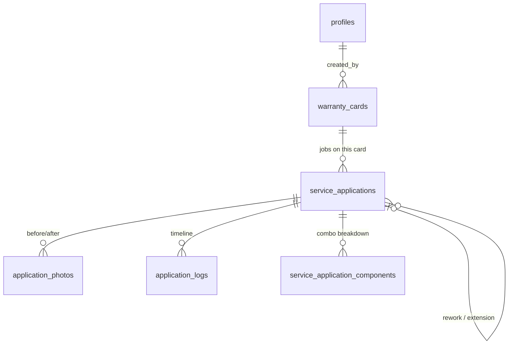

# VonGuard Türkiye

Bilingual marketing site and warranty-verification platform for a vehicle surface-protection studio (PPF, paintless dent repair, scratch removal), built with the Next.js 16 App Router.

**Live demo:** [vonguard-website.vercel.app](https://vonguard-website.vercel.app) — Turkish default, [English version](https://vonguard-website.vercel.app/en) via the locale switcher.


## Highlights

- **Fully bilingual (TR/EN) with localized pathnames** — `next-intl` v4 routes `/tr/hizmetler` and `/en/services` to the same page component, with locale-aware metadata and middleware-driven locale negotiation (`tr` default).
- **Next.js 16 idioms throughout** — async `params`/`searchParams`, App Router layouts, `next/font` self-hosted Google Fonts, all marketing pages statically prerendered (SSG) per locale.
- **Design system as Tailwind v4 tokens** — a "Graphite Steel" dark theme (graphite surfaces, gold accent, steel secondary) declared via `@theme` in `globals.css`; no config file, no hard-coded colors in components.
- **Motion with restraint** — scroll-reveal and hero parallax via `motion` (Framer Motion's successor), wrapped in a reusable `MotionReveal` component.
- **Typed, validated contact form** — `react-hook-form` + `zod` schema shared between the client and the `/api/contact` route handler.
- **Warranty verification system** — QR-coded physical warranty cards resolve to a public lookup page; full schema shipped as Supabase migrations (see below).
- **Cost-engineered for the Supabase free tier** — client-side image compression and capacity math keep ~200 vehicles' worth of warranty records inside the free 1 GB storage quota (see below).

## Stack

| Layer | Choice |
| --- | --- |
| Framework | Next.js 16 (App Router, TypeScript) |
| Styling | Tailwind CSS v4 (`@theme` tokens) |
| i18n | next-intl v4 (localized pathnames) |
| Animation | motion (`motion/react`) |
| Forms | react-hook-form + zod |
| Backend (planned) | Supabase (Postgres + RLS + Storage) |

## Project structure

```
src/
  middleware.ts               next-intl locale negotiation
  i18n/                       routing (localized pathnames), request config, typed navigation
  app/[locale]/               landing, hakkımızda, hizmetler (+3 detail pages), iletişim, garanti
  app/api/contact/route.ts    contact form endpoint (zod-validated)
  components/
    shared/                   Header, Footer, LocaleSwitcher, MotionReveal, LogoMark
    marketing/                Hero, ServiceGrid, ProcessTimeline, ContactForm, ...
    warranty/                 CodeEntryForm
messages/{tr,en}.json         translation bundles
supabase/migrations/          warranty schema, RLS policies, storage buckets
```

## Warranty verification

Every completed job gets a physical warranty card carrying a QR code and a short human-typable code like `VG-2026-A7K9`. The QR deep-links straight to the localized detail page (`/tr/garanti/VG-2026-A7K9` or `/en/warranty/...`); customers without a scanner type the code into the lookup form.

Design decisions baked into the schema (`supabase/migrations/`):

- **Typo-proof codes** — the random segment uses the Crockford alphabet (no `0/1/I/L/O/U`), and lookups go through a `citext` (case-insensitive) unique column, so `vg-2026-a7k9` scribbled from a paper card still resolves.
- **One card per vehicle, many applications** — `warranty_cards` → `service_applications` (PPF, scratch, dent + combo kinds as a Postgres enum) → `application_photos` (before/after, ordered). Reworks and warranty extensions reference the original job via `parent_application_id`, so history is never overwritten.
- **Locked down by default** — RLS on every table; only authenticated admins (`is_admin()` security-definer helper) can read or write raw data. The public lookup runs server-side and returns only customer-facing fields.
- **Abuse-resistant lookups** — every public query is recorded in `lookup_attempts` (IP, code, success), backing rate limiting configured via `RATE_LIMIT_LOOKUP_MAX` / `RATE_LIMIT_LOOKUP_WINDOW_SECONDS` (default 10 lookups / 10 min per IP), so codes can't be brute-forced.
- **Private photo storage** — the storage bucket is non-public; the server hands out short-lived signed URLs, so before/after photos can't be hotlinked or enumerated.

## Database schema

Eight tables, three Postgres enums, RLS on everything. The model separates the *card* (one per vehicle, what the customer holds) from the *applications* on it (individual jobs, each with its own warranty clock):



| Table | Purpose |
| --- | --- |
| `profiles` | 1:1 with `auth.users`; `owner`/`staff` roles drive the `is_admin()` RLS helper |
| `warranty_cards` | One per vehicle — customer, vehicle, and the printed `VG-YYYY-XXXX` code (`citext` unique for case-insensitive lookup) |
| `service_applications` | One per job; `service_kind` enum (`ppf`, `scratch`, `dent` + 3 combos), warranty duration constrained to 5/6/7/10 years, `expires_at` computed at write time |
| `service_application_components` | Which atomic services make up a combo — kept relational for reporting instead of parsing enum names |
| `application_photos` | `photo_kind` enum (`before`/`after`/`progress`/`update`) + `sort_order`; rows store dimensions and byte size, files live in the private bucket |
| `application_logs` | Append-only timeline per job (`applied`, `inspection`, `rework`, `note`, `warranty_extended`) |
| `lookup_attempts` | Every public lookup with IP and outcome — the raw material for rate limiting |
| `contact_messages` | Contact form submissions with locale |

Design details worth noting:

- **Warranty history is append-only.** A rework or extension is a *new* `service_applications` row with `is_primary = false` pointing at the original via `parent_application_id` — the original record and its expiry are never mutated, so disputes can always be traced.
- **Enums where the domain is closed, rows where it isn't.** Service kinds, photo kinds, and log kinds are Postgres enums (typo-proof, index-friendly); combo composition is a join table because reporting needs to ask "all jobs that included PPF" without string-matching enum names.
- **Indexes follow the real access patterns** — `(card_id, applied_on desc)` for the card detail page, `(expires_at)` for expiry reminders, `(ip, created_at desc)` for the rate-limit window scan, `(application_id, kind, sort_order)` for photo galleries.
- **`updated_at` maintained by trigger** (`set_updated_at()`), not by application code — one less invariant for every future writer to remember.

## Cost engineering — fitting a business on the free tier

The brief was to run the whole platform for roughly the price of a domain in year one, so the storage budget is engineered rather than hoped for:

- **Client-side compression before upload** — photos pass through `browser-image-compression` in the admin UI (resize to 1920 px, ~0.8 quality), landing around **~220 KB per photo**. The bucket enforces a **512 KB hard cap** (`file_size_limit`) and allows only `image/jpeg`, `image/png`, `image/webp` — nothing oversized can slip in even if the client is bypassed.
- **Capacity math** — at ≤20 photos per application:

  | | Per vehicle | 200 vehicles |
  | --- | --- | --- |
  | Photos | 20 × ~220 KB ≈ **4.4 MB** | **~880 MB** |
  | Database rows | a few KB | a few MB |

  That fits the Supabase free tier (1 GB storage, 500 MB Postgres) with headroom — roughly **~230 vehicles** before hitting the quota. Row data is negligible next to images.
- **Egress control** — the private bucket + signed-URL model means images are only served to people actually viewing a warranty page, not to scrapers or hotlinkers.
- **Upgrade path, not rewrite** — past ~200 vehicles the only change is Supabase Pro ($25/mo, 100 GB storage); schema, policies, and app code stay identical.

## Getting started

```bash
npm install
cp .env.example .env.local   # Supabase vars can stay empty for the marketing site
npm run dev
```

Open [http://localhost:3000](http://localhost:3000) — you'll be redirected to `/tr`.

## Roadmap

- **Phase 1 — shipped:** bilingual marketing site, contact form, warranty code entry UI.
- **Phase 2:** admin panel with warranty CRUD, photo upload (client-side compression), and QR-coded certificates on Supabase.
- **Phase 3:** public warranty detail page (`/garanti/[code]`) with rate-limited lookups.
- **Phase 4:** email notifications, SEO polish, analytics.

## Notes

Business details in the translation bundles (phone, address, brand narrative) are placeholder/demo copy pending launch. The `CLAUDE.md`/`AGENTS.md` files document the AI-assisted development workflow used on this project.
