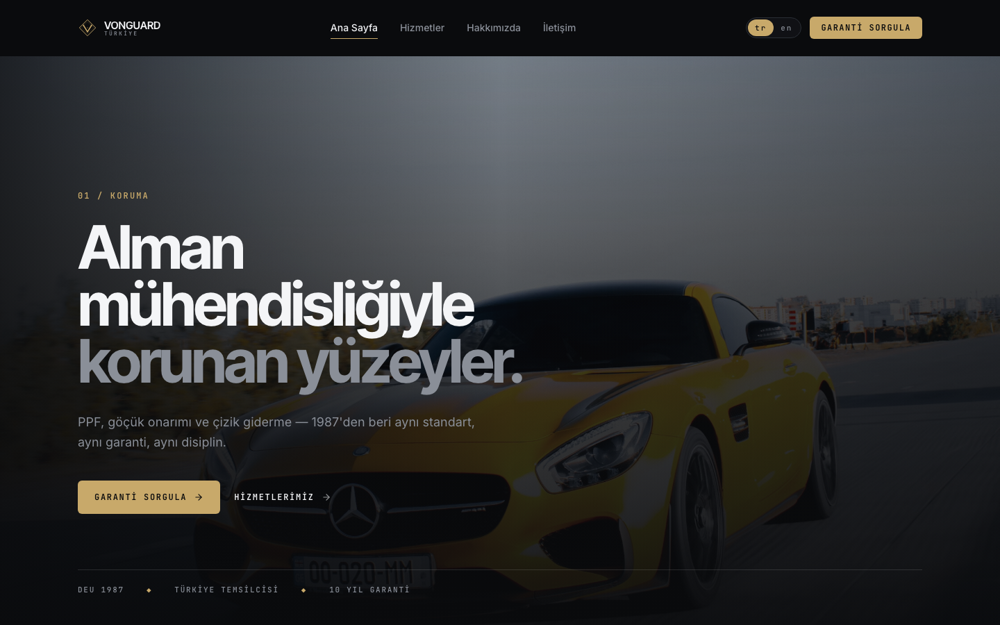

# VonGuard Türkiye

Bilingual marketing site and warranty-verification platform for a vehicle surface-protection studio (PPF, paintless dent repair, scratch removal), built with the Next.js 16 App Router.



## Highlights

- **Fully bilingual (TR/EN) with localized pathnames** — `next-intl` v4 routes `/tr/hizmetler` and `/en/services` to the same page component, with locale-aware metadata and middleware-driven locale negotiation (`tr` default).
- **Next.js 16 idioms throughout** — async `params`/`searchParams`, App Router layouts, `next/font` self-hosted Google Fonts, all marketing pages statically prerendered (SSG) per locale.
- **Design system as Tailwind v4 tokens** — a "Graphite Steel" dark theme (graphite surfaces, gold accent, steel secondary) declared via `@theme` in `globals.css`; no config file, no hard-coded colors in components.
- **Motion with restraint** — scroll-reveal and hero parallax via `motion` (Framer Motion's successor), wrapped in a reusable `MotionReveal` component.
- **Typed, validated contact form** — `react-hook-form` + `zod` schema shared between the client and the `/api/contact` route handler.
- **Warranty lookup flow** — customers enter a certificate code to verify their installation; the schema for the full warranty system (certificates, photos, RLS policies, storage buckets) is written as Supabase migrations in `supabase/migrations/`.

## Stack

| Layer | Choice |
| --- | --- |
| Framework | Next.js 16 (App Router, TypeScript) |
| Styling | Tailwind CSS v4 (`@theme` tokens) |
| i18n | next-intl v4 (localized pathnames) |
| Animation | motion (`motion/react`) |
| Forms | react-hook-form + zod |
| Backend (planned) | Supabase (Postgres + RLS + Storage) |

## Project structure

```
src/
  middleware.ts               next-intl locale negotiation
  i18n/                       routing (localized pathnames), request config, typed navigation
  app/[locale]/               landing, hakkımızda, hizmetler (+3 detail pages), iletişim, garanti
  app/api/contact/route.ts    contact form endpoint (zod-validated)
  components/
    shared/                   Header, Footer, LocaleSwitcher, MotionReveal, LogoMark
    marketing/                Hero, ServiceGrid, ProcessTimeline, ContactForm, ...
    warranty/                 CodeEntryForm
messages/{tr,en}.json         translation bundles
supabase/migrations/          warranty schema, RLS policies, storage buckets
```

## Getting started

```bash
npm install
cp .env.example .env.local   # Supabase vars can stay empty for the marketing site
npm run dev
```

Open [http://localhost:3000](http://localhost:3000) — you'll be redirected to `/tr`.

## Roadmap

- **Phase 1 — shipped:** bilingual marketing site, contact form, warranty code entry UI.
- **Phase 2:** admin panel with warranty CRUD, photo upload (client-side compression), and QR-coded certificates on Supabase.
- **Phase 3:** public warranty detail page (`/garanti/[code]`) with rate-limited lookups.
- **Phase 4:** email notifications, SEO polish, analytics.

## Notes

Business details in the translation bundles (phone, address, brand narrative) are placeholder/demo copy pending launch. The `CLAUDE.md`/`AGENTS.md` files document the AI-assisted development workflow used on this project.
